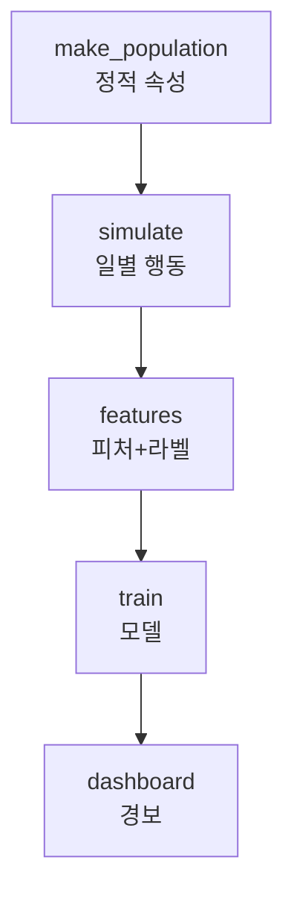

# preemptive-ews-platform

> 인공지능을 활용해 채무 상환이 어려워질 고객을 조기에 포착하는,
> 여신 금융기관을 위한 선제적 조기경보시스템(EWS)
---

## 배경 및 문제의식

[채무조정 서민 상반기만 10만명 육박…3년 새 56% 급증](https://n.news.naver.com/mnews/article/666/0000121238)
<br>위의 기사를 [블로그](https://writedown-remain.tistory.com/107)에 정리하면서 고민했던 지점을 제가 가진 기술로 구현해보고자 이 프로젝트를 시작했습니다. 시작한 이유를 적으면 이렇습니다.
> 대출 채권을 다루는 금융기관에게 채무자의 연체는 직접적인 손실로 이어집니다.
특히 연체가 90일을 넘겨 개인워크아웃(채무조정) 단계에 진입하면,
원금 자체가 감면 대상이 되어 금융기관에 손실로 다가옵니다. (상각채권 기준 최대 70%, 취약계층은 90%까지.)
즉 90일이라는 선을 넘는 순간, 은행이 회수할 수 있었던 원금까지 잃게 됩니다.

> 반면 그 이전 단계(프리워크아웃)까지는 이자만 조정될 뿐 원금은 보전됩니다.
따라서 회수율을 지키는 핵심은 '얼마나 빨리 개입하느냐'에 달려 있습니다.

>그러나 현재의 대응은 대체로 연체가 이미 발생한 뒤에야 이루어진다고 가정합니다.
연체는 결과일 뿐, 그 전에 이미 통장 잔액 감소·현금서비스 의존·공과금 지연 같은
행동 신호가 나타납니다. 

>이 프로젝트는 이러한 비금융·행동 데이터를 결합해 연체가 발생하기 전에 고위험군을 사전 추출하고, 원금 손실이 없는 프리워크아웃·자체 대환대출로 유도하는 것을 목표로 합니다.

## 핵심 가정

<!--
TODO: "연체는 결과이고, 그 전에 잔액 감소·현금서비스·공과금 지연 같은
      행동 신호가 먼저 나타난다"를 한 문단으로.
      이 가정이 프로젝트 전체의 전제임을 명시.
-->
대출 연체는 결국 버티다 터진 풍선같은 것입니다. 그 이전에 행동 신호가 먼저 나타난다고 가정을 하고 실험을 진행했습니다.  

---

## 시스템 아키텍처

<!--
TODO: 데이터 흐름을 그림 또는 텍스트 다이어그램으로.
      시뮬레이터 → 데이터 저장 → 피처 → 모델 → 경보/대시보드
      (구현 다 하고 나서 실제 구조에 맞춰 그리기.
       지금은 자리만 잡아두기)
-->



---

## 진행 상황

- [x] 시뮬레이터: 정적 속성 생성 (make_population)
- [x] 시뮬레이터: 일별 건전성 변동 (simulate)
- [ ] 시뮬레이터: 행동(잔액·현금서비스·공과금) + 연체 로직
- [ ] 피처 엔지니어링 + 라벨 생성
- [ ] 모델 학습
- [ ] 대시보드

## 핵심 설계 결정 (docs/ 로 분리 가능)

<!--
TODO: 구현하면서 내린 판단들을 ADR 형식으로 기록.
      각 항목은 docs/ 안에 별도 파일로 빼도 좋음.
      아래는 채워야 할 결정 목록:
-->

### 1. 왜 랜덤이 아니라 '숨겨진 상태' 기반으로 데이터를 만들었나
<!-- 맥락 / 결정 / 이유(consequences) 3단 구조로 -->
- **맥락**: 잔액과 연체를 각각 독립적으로 랜덤 생성하면 둘 사이에 상관관계가 없어 모델이 학습할 패턴이 존재하지 않는다. 그냥 쌀알 뿌리는 것과 다름이 없다. 
- **결정**: 각 고객에게 모델이 관측 불가능한 '재무건전성(health)' 상태를 부여하고, 
이 상태가 행동(잔액·현금서비스·공과금)과 연체를 동시에 만들도록 설계했다.
- **이유**: 같은 원인에서 나오므로 행동과 연체가 자연스럽게 상관된다.
  또한 모델에는 health를 주지 않아, 현실 금융기관이 고객의 재무 스트레스를
  직접 못 보고 행동 흔적만으로 추론하는 상황을 그대로 재현한다.

### 2. 왜 라벨을 '미래 30일' 구간으로 정의했나 (구현 예정)
<!-- 데이터 누수 방지 논리. 피처는 과거, 라벨은 미래. -->

### 3. 왜 고객 단위로 train/test를 나눴나 (구현 예정)
<!-- 같은 고객이 양쪽에 걸치면 누수. -->

### 4. 왜 정확도(accuracy)가 아니라 PR-AUC를 봤나 (구현 예정)
<!-- 양성(연체)이 소수인 불균형 데이터이기 때문. -->

---

## 실행 방법

<!--
TODO: 구현 끝나면 실제 명령어로 채우기.
      복사-붙여넣기 하면 그대로 돌아가게 쓰는 게 핵심.
-->

```bash
python src/simulator.py
```

---

## 결과

<!--
TODO: 구현 후 실제 숫자로 채우기.
      - 모델 성능 (AUC, PR-AUC, baseline 대비)
      - 상위 N% 경보의 precision / recall
      - 핵심 피처 중요도
      - 가능하면 대시보드 스크린샷
-->

---

## 향후 계획

<!--
TODO: 확장 로드맵.
      - 데이터 파이프라인 자동화 (DB 적재 + 스케줄러)
      - MLOps (드리프트 감지, 자동 재학습)
      - 모델 고도화 (시계열 모델, 설명가능성)
-->

---

## 기술 스택

<!-- TODO: 실제 사용한 것만. Python, pandas, XGBoost, ... -->
- Python
- numpy
- pandas
## 참고 / 출처

<!--
TODO: 배경에서 인용한 사실의 출처.
      - 신용회복위원회 채무조정 제도 (원금 감면율 등)
-->
## 참고 / 출처

- [채무조정 서민 상반기만 10만명...](뉴스 링크) — 프로젝트 착수 배경
- 신용회복위원회 채무조정 제도 (원금 감면율 기준)
- 소득 통계: 통계청 임금근로일자리 소득결과 → 자세한 내용은 `docs/data-sources.md`
- 설계 결정 상세: `docs/` 참조
